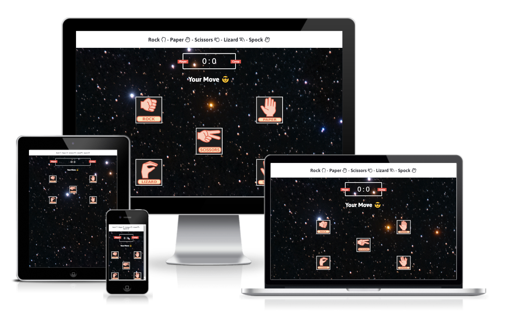

# Rock Paper Scissors Lizard Spock

This project is based on the game of chance called “Rock, Paper, Scissors, Lizard, Spock”. The game itself is an expanded version of the classic “Rock, Paper, Scissors” game. 

The game is targeted towards individuals interested in interactive games and web development.

The goal of this project is to provide a fun and entertaining game which is not too complicated to play.

