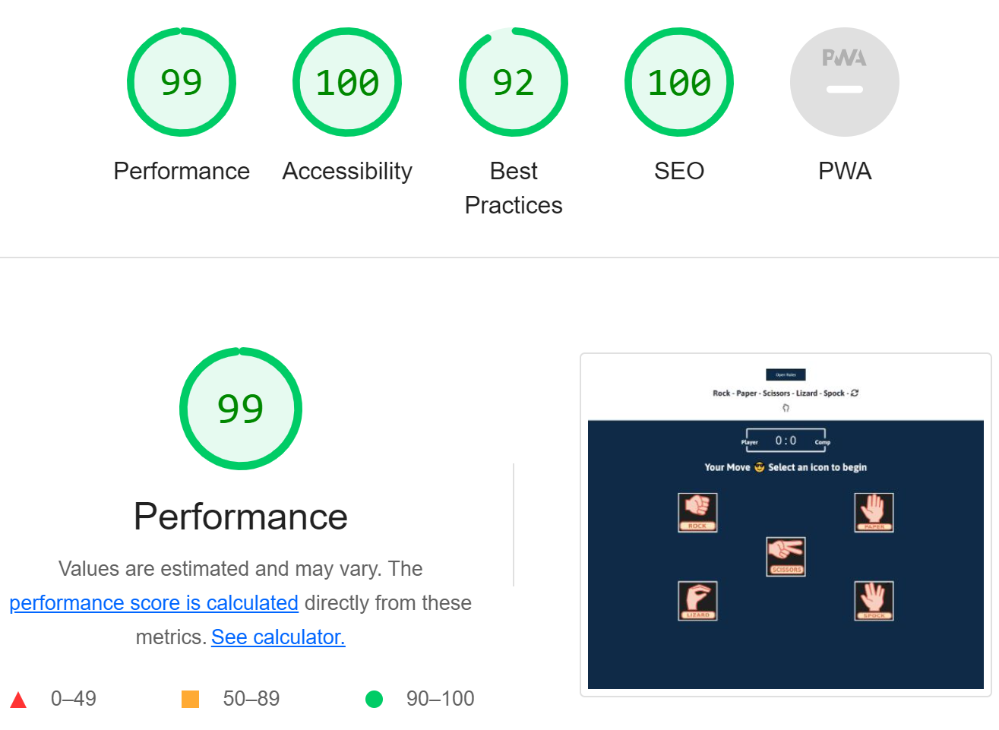

# Rock Paper Scissors Lizard Spock

This project is based on the game of chance called “Rock, Paper, Scissors, Lizard, Spock”. The game itself is an expanded version of the classic “Rock, Paper, Scissors” game. The game is easy to play. The player chooses ones of the options by clicking on any of the five icons representing Rock, Paper, Scissors, Lizard, or Spock. Then the computer makes a random selection and the winner is determined by the rules of the game.

The game is targeted towards individuals interested in interactive games and web development.

The goal of this project is to provide a fun and entertaining game which is not too complicated to play.

[View the live project here](https://pajohack.github.io/rock-paper-scissors-lizard-spock/)

## Features

- Header

   - The header area contains a heading with the name of the game along with fontawesome icon that changes every two seconds.
   - The "Open Rules" button displays a modal showing the rules of the game. Clicking the x icon or anywhere outside of the modal, closes the modal.
   - Clicking the refresh icon re-loads the page and re-starts the game.

 

- Scoreboard

   - The scoreboard area displays the player & computer scores.
   - It contains a player and a computer badge on each side so you can, at a glance differentiate between the two.

 

- Result

   - The results area displays the outcome after each round of the game.
   - At the start of the game, "Your Move 😎 Select an icon to begin" is displayed.
   - If the player wins, the outcome of the match is shown with the message "You WIN!".
   - If the computer wins, the outcome of the match is shown with the message "You LOST!".
   - When the outcome is tied, a message with "It's a DRAW!" is shown.

 

- Game area

   - The game area contains five icons representing the five possible options.
   - When an icon is hovered over or tapped, a lightblue border appears to give feedback that this is the option selected or about to be selected.
   - If the player wins the round, a green outline and shadow appears around the icon indicating a win.
   - If the computer wins the round, a red outline and shadow appears around the image indicating a lose.
   - If both the player and computer select the same option, the border is unchanged, but the outcome of a draw is displayed in the results area.

 

## Testing

- functionality

| Test Label       | Test Action    | Expected Outcome                                                                   | Test Outcome |
|------------------|----------------|------------------------------------------------------------------------------------|--------------|
| Rules   button   | Click   button | Modal   opens displaying the rules of the game                                     | PASS         |
| X icon           | Click icon     | Modal closes                                                                       | PASS         |
| Refresh   icon   | Click   icon   | Page   is re-loaded                                                                | PASS         |
| Rock image       | Select image   | The border of the image turns lightblue                                            | PASS         |
| Rock   image     | Select   image | Player   wins and a green border and shadow are shown around the image temperarily | PASS         |
| Rock image       | Select image   | Computer wins and a red border and shadow   are shown around the image temperarily | PASS         |
| Paper   image    | Select   image | The   border of the image turns lightblue                                          | Pass         |
| Paper image      | Select image   | Player wins and a green border and shadow   are shown around the image temperarily | PASS         |
| Paper   image    | Select   image | Computer   wins and a red border and shadow are shown around the image temperarily | PASS         |
| Scissors image   | Select image   | The border of the image turns lightblue                                            | PASS         |
| Scissors   image | Select   image | Player   wins and a green border and shadow are shown around the image temperarily | PASS         |
| Scissors image   | Select image   | Computer wins and a red border and shadow   are shown around the image temperarily | PASS         |
| Lizard   image   | Select   image | The   border of the image turns lightblue                                          | PASS         |
| Lizard image     | Select image   | Player wins and a green border and shadow   are shown around the image temperarily | PASS         |
| Lizard   image   | Select   image | Computer   wins and a red border and shadow are shown around the image temperarily | PASS         |
| Spock image      | Select image   | The border of the image turns lightblue                                            | PASS         |
| Spock   image    | Select   image | Player   wins and a green border and shadow are shown around the image temperarily | PASS         |
| Spock image      | Select image   | Computer wins and a red   border and shadow are shown around the image temperarily | PASS         |

 

- Browser Compatibility

   - The website was tested in different browsers and works well in each one.
   - Browsers used: Chrome, FireFox, Edge & Safari.

 

- Responsivness

   - I used Google Developer tools to check the responsiveness of the site on different screen sizes. The site responded well to very large screens such as iMac Pro, medium screens such as iPad Pro and very small screens such as iPhone SE.
   - On smaller screens the font-size and the images are reduced in size to ensure everything is visible and viable.

 

- Validation

  - HTML. After using the W3C validator, no errors were found.
  - CSS. After using Jigsaw validator, errors were present.
  - The Javascript was run through jshint, no ES6 warnings were given.
  - Accessibility. I confirmed that the site meets the required needs by using lighthouse to validate.

 

 

## Bugs

- Squashed Bugs

   - On smaller screens the game icons were not shown on the screen. Adding a media query rule to reduce the size solved the problem.
   - I originally had a background image that did not contrast with the game area and was distracting. It was an image of outer space. I replaced it with a cleaner looking background which compliments the game area.

- Unfixed Bugs

   - There are no unfixed bugs that I can find.

 

## Deployment

- The site was deployed via GitHub Pages. This is achieved through your GitHub repository by clicking on settings and selecting "Pages" in the code and automation section. Under the "Build and deployment" heading use deploy from a branch option. Then, under the "Branch" heading, select master branch. After a few moments a link to the live project is created and available to browse and share. 

- Any alterations made to the files can be pushed to GitHub with the "git push" command in the terminal. GitHub Pages picks up the changes and updates the live site after a moment or two.

- Users can download a copy of the files in this project to their local computer by cloning the repository. There are three ways of doing this, download a Zip, use SSH or, using HTTPS.
- You can also fork the repository to your personal GitHub. This is done by clicking the fork button on the top-right hand corner. 

- [View the live project here](https://pajohack.github.io/rock-paper-scissors-lizard-spock/)

 

## Credits

- Content

   - I took inspiration for my game after watching this tutorial on YouTube, [freeCodeCamp.org](https://www.youtube.com/watch?v=jaVNP3nIAv0&list=PLuPRotimWN7P4ahbxERol7yWIInp8loeA&index=25)
   - The background image was taken from [BGJar](https://bgjar.com/colored-shapes)
   - I found images for the game icons here [Open Clip-art](https://openclipart.org/detail/325665/rock-paper-scissors-lizard-spock)

 

## Technologies & Tools Used

 

- HTML5
- CSS3
- JavaScript
- Fontawesome
